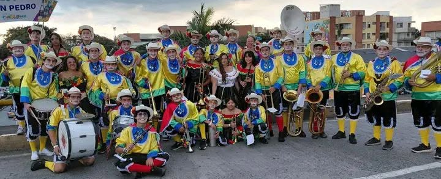

# WWW.BANDASANTACECLILIASANPEDROVALLE.COM
 :root {
            --rojo: #8b0000;
            --oro: #d4af37;
            --texto: #2f2f2f;
        }

        body {
            font-family: 'Segoe UI', Tahoma, Geneva, Verdana, sans-serif;
            background: linear-gradient(135deg, #fdfdfd 0%, #f4ebd0 100%);
            color: var(--texto);
        }

        .navbar {
            box-shadow: 0 2px 10px rgba(0, 0, 0, 0.08);
        }

        .navbar-brand {
            font-weight: 700;
            letter-spacing: 0.08em;
        }

        .navbar .form-control {
            min-width: 180px;
            border-radius: 999px;
            border: 1px solid rgba(255, 255, 255, 0.25);
            background: rgba(255, 255, 255, 0.12);
            color: white;
        }

        .navbar .form-control::placeholder {
            color: rgba(255, 255, 255, 0.75);
        }

        .navbar .form-control:focus {
            background: white;
            color: #222;
            box-shadow: none;
        }

        .navbar .btn-outline-light {
            border-radius: 999px;
            padding: 0.35rem 0.8rem;
        }

        .hero-card {
            background: rgba(255, 255, 255, 0.95);
            border: 1px solid #eee;
            border-radius: 1.2rem;
            box-shadow: 0 8px 25px rgba(0, 0, 0, 0.08);
        }

        .titulo-principal {
            font-size: clamp(1.8rem, 4vw, 3rem);
            font-weight: 800;
            color: var(--rojo);
            text-shadow: 1px 1px 2px rgba(0, 0, 0, 0.1);
            line-height: 1.15;
        }

        .subtitulo {
            color: #6c6c6c;
            font-size: clamp(1rem, 2.3vw, 1.25rem);
        }

        .video-title {
            font-size: clamp(1.8rem, 4vw, 2.4rem);
            font-weight: 800;
            color: var(--rojo);
            text-shadow: 1px 1px 2px rgba(0, 0, 0, 0.12);
            margin-bottom: 1rem;
            position: relative;
        }

        .video-title::after {
            content: "";
            display: block;
            width: 5rem;
            height: 0.35rem;
            margin-top: 0.75rem;
            border-radius: 999px;
            background: linear-gradient(90deg, var(--rojo), var(--oro));
        }

        .video-card {
            background: white;
            border-radius: 1.2rem;
            box-shadow: 0 8px 25px rgba(0, 0, 0, 0.08);
            padding: 1rem;
        }

        .frase-nubecita {
            position: relative;
            background: rgba(255, 255, 255, 0.96);
            border: 1px solid rgba(212, 175, 55, 0.35);
            box-shadow: 0 14px 40px rgba(0, 0, 0, 0.08);
            border-radius: 2rem;
            padding: 1.6rem 1.4rem;
            margin: 1.75rem 0;
            backdrop-filter: blur(8px);
        }

        .frase-nubecita::before {
            content: "";
            position: absolute;
            top: -18px;
            left: 1.4rem;
            width: 60px;
            height: 34px;
            background: rgba(255, 255, 255, 0.95);
            border-radius: 50%;
            box-shadow: 28px 10px 0 rgba(255, 255, 255, 0.95), 50px 18px 0 rgba(255, 255, 255, 0.95);
        }

        .frase-nubecita h3 {
            color: var(--rojo);
            margin-bottom: 0.75rem;
        }

        .frase-nubecita p {
            color: #3a3a3a;
            font-size: 1.05rem;
            line-height: 1.75;
            margin-bottom: 0;
        }

        .carousel-item img {
            height: 320px;
            object-fit: cover;
            border-radius: 1rem;
        }

        @media (max-width: 768px) {
            .carousel-item img {
                height: 240px;
            }

            .hero-card {
                padding: 1.25rem;
            }
        }
<!DOCTYPE html>
<html lang="es">

<head>
    <meta charset="UTF-8">
    <meta name="viewport" content="width=device-width, initial-scale=1.0">
    <title>BANDA SANTA CECILIA SAN PEDRO VALLE</title>
    <link href="https://cdn.jsdelivr.net/npm/bootstrap@5.3.8/dist/css/bootstrap.min.css" rel="stylesheet"
        integrity="sha384-sRIl4kxILFvY47J16cr9ZwB07vP4J8+LH7qKQnuqkuIAvNWLzeN8tE5YBujZqJLB" crossorigin="anonymous">
    <link rel="stylesheet" href="estilo.css">
</head>

<body>
    <nav class="navbar navbar-expand-lg navbar-dark bg-dark">
        

            <a class="navbar-brand" href="Index.html">BANDA SANTA CECILIA</a>
            <button class="navbar-toggler" type="button" data-bs-toggle="collapse" data-bs-target="#navbarNav"
                aria-controls="navbarNav" aria-expanded="false" aria-label="Toggle navigation">
                
            </button>
            

                <ul class="navbar-nav ms-auto align-items-lg-center">
                    <li class="nav-item">
                        <a class="nav-link active" aria-current="page" href="Index.html">Inicio</a>
                    </li>
                    <li class="nav-item">
                        <a class="nav-link" href="MomentosDeLaBanda.html">Historia</a>
                    </li>
                    <li class="nav-item">
                        <a class="nav-link" href="Videos.html">Videos</a>
                    </li>   
                    <li class="nav-item">
                        <a class="nav-link" href="Publicaciones.html">Publicaciones</a>
                    </li>   
    </nav>

    <main class="container py-4 py-md-5">
        <section class="row g-4 align-items-center mb-4">
            

                

                    
Tradición
                        y cultura

                    <h1 class="titulo-principal mb-3">Banda de Músicos Santa Cecilia de San Pedro</h1>
                    <h2 class="subtitulo mb-3">Tradición, Cultura y Patrimonio Musical desde 1952</h2>
                    

                        La Banda de Músicos Santa Cecilia de San Pedro es una agrupación tradicional del Valle del
                        Cauca,
                        fundada en 1952, dedicada a preservar y difundir la música colombiana con identidad y orgullo.
                    

                

            

            

                

                    

                        

                            
                        

                        

                            
                        

                        

                            
                        

                        

                            
                        

                    

                    <button class="carousel-control-prev" type="button" data-bs-target="#carouselExample"
                        data-bs-slide="prev">
                        
                        Anterior
                    </button>
                    <button class="carousel-control-next" type="button" data-bs-target="#carouselExample"
                        data-bs-slide="next">
                        
                        Siguiente
                    </button>
                

            

            <h1 class="video-title">90 Años, Banda Santa Cecilia</h1>
            <video width="500" height="460" controls>
                <source src="Videos/90 Años, Banda Santa Cecilia (San Pedro, Valle del Cauca).mp4" type="video/mp4">
                Tu navegador no soporta la reproducción de videos.
            </video>

        </section>

        
</body>

</html>
<!DOCTYPE html>
<html lang="en">

<head>
    <meta charset="UTF-8">
    <meta name="viewport" content="width=device-width, initial-scale=1.0">
    <title>Historia de la Banda</title>
    <link href="https://cdn.jsdelivr.net/npm/bootstrap@5.3.8/dist/css/bootstrap.min.css" rel="stylesheet"
        integrity="sha384-sRIl4kxILFvY47J16cr9ZwB07vP4J8+LH7qKQnuqkuIAvNWLzeN8tE5YBujZqJLB" crossorigin="anonymous">
    <link rel="stylesheet" href="estilo.css">
</head>

<body>
    <nav class="navbar navbar-expand-lg navbar-dark bg-dark">
        

            <a class="navbar-brand" href="Index.html">BANDA SANTA CECILIA</a>
            <button class="navbar-toggler" type="button" data-bs-toggle="collapse" data-bs-target="#navbarNav"
                aria-controls="navbarNav" aria-expanded="false" aria-label="Toggle navigation">
                
            </button>
            

                <ul class="navbar-nav ms-auto align-items-lg-center">
                    <li class="nav-item">
                        <a class="nav-link active" aria-current="page" href="Index.html">Inicio</a>
                    </li>
                    <li class="nav-item">
                        <a class="nav-link" href="MomentosDeLaBanda.html">Historia</a>
                    </li>
                    <li class="nav-item">
                        <a class="nav-link" href="Videos.html">Videos</a>
                    </li>
                    <li class="nav-item">
                        <a class="nav-link" href="Publicaciones.html">Publicaciones</a>
                    </li>
    </nav>
    <main class="container py-4 py-md-5">
        <section class="row g-4 align-items-center mb-4">
            <h1 class="titulo-principal mb-3">Historia de la Banda Santa Cecilia de San Pedro, Valle del Cauca</h1>
             
            
La Banda Santa Cecilia de San Pedro, Valle del Cauca, es una agrupación musical que representa el
                talento, la cultura y las tradiciones de su municipio. A lo largo de los años se ha convertido en un
                símbolo de identidad para la comunidad, formando generaciones de músicos y llevando el nombre de San
                Pedro a diferentes escenarios del departamento y del país.
                  
                Según las imágenes y el material audiovisual, la historia de la banda está marcada por el esfuerzo de
                directores, maestros, músicos y familias que han trabajado unidos para mantener viva la tradición
                bandística del municipio. La agrupación ha servido como una escuela artística donde niños y jóvenes
                aprenden disciplina, responsabilidad, trabajo en equipo y amor por la música.
                  
                Desde sus inicios, la banda ha participado en desfiles, actos cívicos, celebraciones religiosas,
                concursos y festivales de bandas musicales, destacándose por la calidad de sus interpretaciones y el
                compromiso de sus integrantes. Con el paso del tiempo, muchos de sus músicos han crecido dentro de la
                institución, pasando de ser estudiantes a convertirse en referentes y apoyo para las nuevas
                generaciones.
            

            <h2 class="titulo-principal mb-3">Las fotografías muestran la evolución de la agrupación:</h2>
            <ol>
                <li>Los jóvenes músicos participan activamente en los ensayos y presentaciones.</li>
                <li>La banda cuenta con diferentes familias instrumentales como percusión, saxofones, clarinetes,
                    trombones, trompetas y tubas.</li>
                <li>Ha realizado presentaciones en escenarios importantes y conciertos especiales ante cientos de
                    espectadores.</li>
                <li>También participa en desfiles y actividades culturales que fortalecen las tradiciones del municipio.
                </li>
                <li>La unión entre músicos, directores, padres de familia y comunidad ha sido fundamental para su
                    crecimiento.</li>
            </ol>
             
            
Uno de los aspectos más valiosos de la Banda Santa Cecilia es su capacidad para reunir a varias
                generaciones de músicos. En el video se observa el reconocimiento a quienes hicieron parte de la
                historia de la agrupación y contribuyeron a su desarrollo durante décadas, permitiendo que hoy continúe
                siendo una institución cultural de gran importancia para San Pedro.
                 
                Actualmente, la banda sigue formando nuevos talentos y representando con orgullo al municipio en
                diferentes eventos y concursos, demostrando que la música es una herramienta de transformación social y
                cultural.
                  
            <h3 class="titulo-principal mb-3">Conclusión</h3>
            La Banda Santa Cecilia de San Pedro no es solamente una agrupación musical; es una familia y un
            patrimonio cultural del municipio. Su historia refleja dedicación, perseverancia y pasión por la música,
            valores que continúan inspirando a las nuevas generaciones de músicos sampedreños y fortaleciendo la
            identidad cultural de la región.
            

             
            

                <h3 class="titulo-principal mb-3">Frase conmemorativa</h3>
                
"Noventa años de historia, tradición y música al servicio de la cultura de San Pedro, Valle del
                    Cauca;
                    formando generaciones y llevando con orgullo el nombre de nuestro municipio a cada escenario."

            

            
             

        </section>
    </main>

    
</body>

</html>
<!DOCTYPE html>
<html lang="es">

<head>
    <meta charset="UTF-8">
    <meta name="viewport" content="width=device-width, initial-scale=1.0">
    <title>Banda Santa Cecilia - Publicaciones</title>
    <link href="https://cdn.jsdelivr.net/npm/bootstrap@5.3.8/dist/css/bootstrap.min.css" rel="stylesheet"
        integrity="sha384-sRIl4kxILFvY47J16cr9ZwB07vP4J8+LH7qKQnuqkuIAvNWLzeN8tE5YBujZqJLB" crossorigin="anonymous">
    
</head>

<body>
    <nav class="navbar navbar-expand-lg navbar-dark bg-dark">
        

            <a class="navbar-brand" href="Index.html">BANDA SANTA CECILIA</a>
            <button class="navbar-toggler" type="button" data-bs-toggle="collapse" data-bs-target="#navbarNav"
                aria-controls="navbarNav" aria-expanded="false" aria-label="Toggle navigation">
                
            </button>
            

                <ul class="navbar-nav ms-auto align-items-lg-center">
                    <li class="nav-item">
                        <a class="nav-link active" aria-current="page" href="Index.html">Inicio</a>
                    </li>
                    <li class="nav-item">
                        <a class="nav-link" href="MomentosDeLaBanda.html">Historia</a>
                    </li>
                    <li class="nav-item">
                        <a class="nav-link" href="Videos.html">Videos</a>
                    </li>
                    <li class="nav-item">
                        <a class="nav-link" href="Publicaciones.html">Publicaciones</a>
                    </li>
                </ul>
            

        

    </nav>
    <header>
        <h1>🎺 Banda Santa Cecilia</h1>
        
90 años de historia, tradición y música en San Pedro, Valle del Cauca

    </header>

    

        <section class="panel">
            <h2>Crear publicación</h2>

            

                <label for="rol">Publicado por</label>
                <select id="rol">
                    <option value="Administrador">Autor de la Pagina web</option>
                    <option value="Director de la banda">Director de la banda</option>
                    <option value="Miembro de la banda">Miembro de la banda</option>
                     <option value="Visitante">Visitante</option>
                </select>
            

            

                <label for="texto">Mensaje</label>
                <textarea id="texto" placeholder="Escribe una noticia, saludo o recuerdo para la banda..."></textarea>
            

            

                <label for="archivo">Adjuntar imagen o video</label>
                <input type="file" id="archivo" accept="image/*,video/*">
            

            <button onclick="publicar()">Publicar</button>
            
Las publicaciones se guardan en este navegador para que permanezcan visibles aunque cierres
                o recargues la página.

        </section>

        

    

    

    
</body>

</html>
<!DOCTYPE html>
<html lang="en">

<head>
    <meta charset="UTF-8">
    <meta name="viewport" content="width=device-width, initial-scale=1.0">
    <title>Videos Banda Santa Cecilia</title>
    <link href="https://cdn.jsdelivr.net/npm/bootstrap@5.3.8/dist/css/bootstrap.min.css" rel="stylesheet"
        integrity="sha384-sRIl4kxILFvY47J16cr9ZwB07vP4J8+LH7qKQnuqkuIAvNWLzeN8tE5YBujZqJLB" crossorigin="anonymous">
    <link rel="stylesheet" href="estilo.css">
</head>

<body>
    <nav class="navbar navbar-expand-lg navbar-dark bg-dark">
        

            <a class="navbar-brand" href="Index.html">BANDA SANTA CECILIA</a>
            <button class="navbar-toggler" type="button" data-bs-toggle="collapse" data-bs-target="#navbarNav"
                aria-controls="navbarNav" aria-expanded="false" aria-label="Toggle navigation">
                
            </button>
            

                <ul class="navbar-nav ms-auto align-items-lg-center">
                    <li class="nav-item">
                        <a class="nav-link active" aria-current="page" href="Index.html">Inicio</a>
                    </li>
                    <li class="nav-item">
                        <a class="nav-link" href="MomentosDeLaBanda.html">Historia</a>
                    </li>
                    <li class="nav-item">
                        <a class="nav-link" href="Videos.html">Videos</a>
                    </li>
                    <li class="nav-item">
                        <a class="nav-link" href="Publicaciones.html">Publicaciones</a>
                    </li>
    </nav>
    <main class="container py-4 py-md-5">
        <h1 class="video-title">Presentación de la Banda</h1>
        <video width="500" height="460" controls>
            <source
                src="Videos/Banda Santa Cecilia de San Pedro Valle en Tocancipa - Mosaico de Viaje por mi Pacifico.mp4"
                type="video/mp4">
            Tu navegador no soporta la reproducción de videos.
        </video>
        <main class="container py-4 py-md-5">
            <h1 class="video-title">Taller de Música con la Banda Santa Cecilia (Mayores de Edad)</h1>
            <video width="500" height="460" controls>
                <source src="Videos/Banda Santa Cecilia San Pedro Valle - Corozal y Sincelejo.mp4" type="video/mp4">
                Tu navegador no soporta la reproducción de videos.
            </video>
             
            <main class="container py-4 py-md-5">
                <h1 class="video-title">Procesión de Semana Santa 2017</h1>
                <video width="500" height="460" controls>
                    <source src="Videos/Banda Santa Cecilia San Pedro Valle PROCESION SEMANA SANTA 2017.mp4"
                        type="video/mp4">
                    Tu navegador no soporta la reproducción de videos.
                </video>
                 
                <main class="container py-4 py-md-5">
                    <h1 class="video-title">Canto a la Alegría - Banda Juvenil Santa Cecilia</h1>
                    <video width="500" height="460" controls>
                        <source src="Videos/canto a la alegría Banda juvenil Santa Cecilia.mp4" type="video/mp4">
                        Tu navegador no soporta la reproducción de videos.
                    </video>
                     

                    
</body>

</html>
